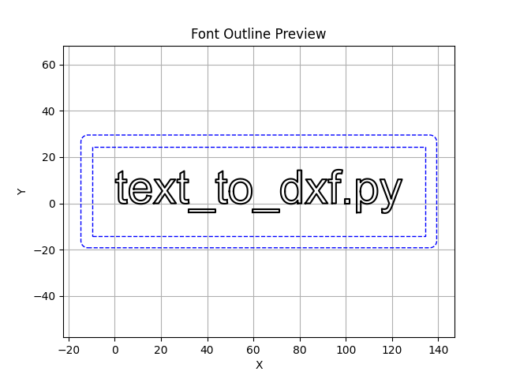

# Text to DXF



A Python script to convert text into DXF vector outlines. This is useful for generating paths for CNC machines, laser cutters, or for use in CAD software.

## Features

*   Converts text to DXF using TrueType (.ttf) and OpenType (.otf) fonts.
*   Supports system-installed fonts and local font files.
*   Adjustable font size, character spacing, and kerning.
*   Lists available system fonts.

## Usage

### Listing available fonts

To see a list of fonts available on your system:

```bash
python text_to_dxf.py --list-fonts
```

### Basic Conversion

To convert a string of text to a DXF file:

```bash
python text_to_dxf.py "Your Text Here" -o output.dxf
```

This will use the default font (Arial) and settings.

### Multi-line Text

To render multiple lines of text, provide each line as a separate argument. You can also adjust the vertical spacing between lines:

```bash
python text_to_dxf.py "First Line" "Second Line" "Third Line" -o multi_line.dxf --line-spacing 1.5
```

### Specifying a Font

You can specify a system font by name:

```bash
python text_to_dxf.py "Hello World" -o hello.dxf --font "Times New Roman"
```

Or use a local font file:

```bash
python text_to_dxf.py "Custom Font" -o custom.dxf --font ./gunplay.ttf
```

### Adjusting Size and Spacing

You can control the font size (in mm) and character spacing:

```bash
python text_to_dxf.py "Sized" -o sized.dxf --size 50 --spacing 1.5
```

### Previewing the Output

You can generate a preview of the text outlines using `matplotlib`.

To display a preview on the screen without saving a DXF file:

```bash
python text_to_dxf.py "Preview" --preview
```

To save the preview to an image file:

```bash
python text_to_dxf.py "Save Preview" --preview-file preview.png
```

You can also use the preview flags in conjunction with generating a DXF file:

```bash
python text_to_dxf.py "Both" -o output.dxf --preview
```

### Controlling Kerning

Kerning is enabled by default to ensure proper character spacing for fonts that support it. You can disable it using the `--no-kerning` flag:

```bash
python text_to_dxf.py "AVATAR" -o avatar.dxf --font gunplay.ttf --no-kerning
```

### Surrounding Text with Shapes

You can add a surrounding rectangular shape around the text with customizable padding, gap, and corner radius.

**Simple Rectangle:**

```bash
python text_to_dxf.py "Hello" -o output_rect.dxf --surround rectangle --padding 10 --corner-radius 5 --preview
```

**Double Rectangle:**

```bash
python text_to_dxf.py "World" -o output_double_rect.dxf --surround double_rectangle --padding 10 --gap 3 --corner-radius 5 --preview
```

**Rectangle with no rounded corners:**

```bash
python text_to_dxf.py "Test" -o output_sharp_rect.dxf --surround rectangle --padding 10 --corner-radius 0 --preview
```

### All Options

```
usage: text_to_dxf.py [-h] [--list-fonts] [--font FONT] [--font-index FONT_INDEX]
                      [--size SIZE] [--spacing SPACING] [--quality {low,medium,high}]
                      [--kerning | --no-kerning] [-v] [--preview]
                      [--preview-file PREVIEW_FILE] [-o OUTPUT]
                      [--surround {none,rectangle,double_rectangle}]
                      [--padding PADDING] [--gap GAP]
                      [--corner-radius CORNER_RADIUS] [--line-spacing LINE_SPACING]
                      text [text ...]

Convert text to DXF font outlines

positional arguments:
  text                  Text string(s) to convert. Each argument represents a new line.

options:
  -h, --help            show this help message and exit
  --list-fonts          List all available system fonts and exit
  --font FONT           Font name to use (default: Arial) or path to font file
  --font-index FONT_INDEX
                        For .ttc font collections, specify the font index to use (default: 0)
  --size SIZE           Font size in mm (default: 20)
  --spacing SPACING     Character spacing multiplier (default: 1.0)
  --quality {low,medium,high}
                        Curve quality: low, medium, or high (default: high)
  --kerning, --no-kerning
                        Enable/disable font kerning (default: --kerning)
  -v, --verbose         Enable verbose debug output
  --preview             Preview the generated paths using matplotlib
  --preview-file PREVIEW_FILE
                        Save the matplotlib preview to a file
  -o OUTPUT, --output OUTPUT
                        Output DXF file path (default: output.dxf)
  --line-spacing LINE_SPACING
                        Multiplier for vertical spacing between lines (default: 1.5)

Arguments for surrounding shape:
  --surround {none,rectangle,double_rectangle}
                        Surround the text with a shape (default: none)
  --padding PADDING     Padding between text and surrounding shape in mm (default: 5.0)
  --gap GAP             Gap between double rectangles in mm (default: 3.0)
  --corner-radius CORNER_RADIUS
                        Corner radius for surrounding rectangles in mm (default: 0.0)
```

## Requirements

*   Python 3
*   `fonttools`
*   `ezdxf`
*   `tqdm`
*   `matplotlib`

You can install the required libraries using pip:

```bash
pip install -r requirements.txt
```

or

```bash
pip install fonttools ezdxf tqdm matplotlib
```